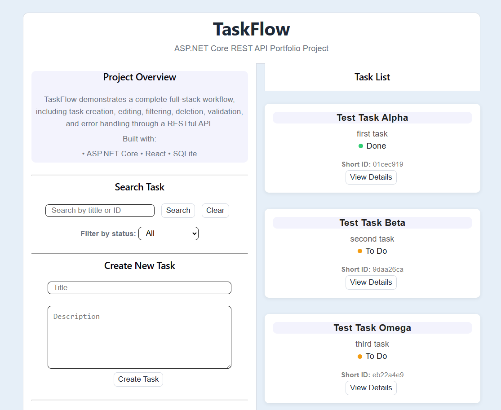
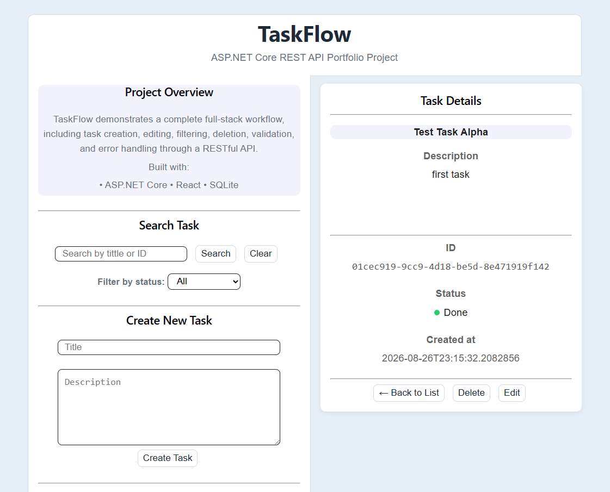
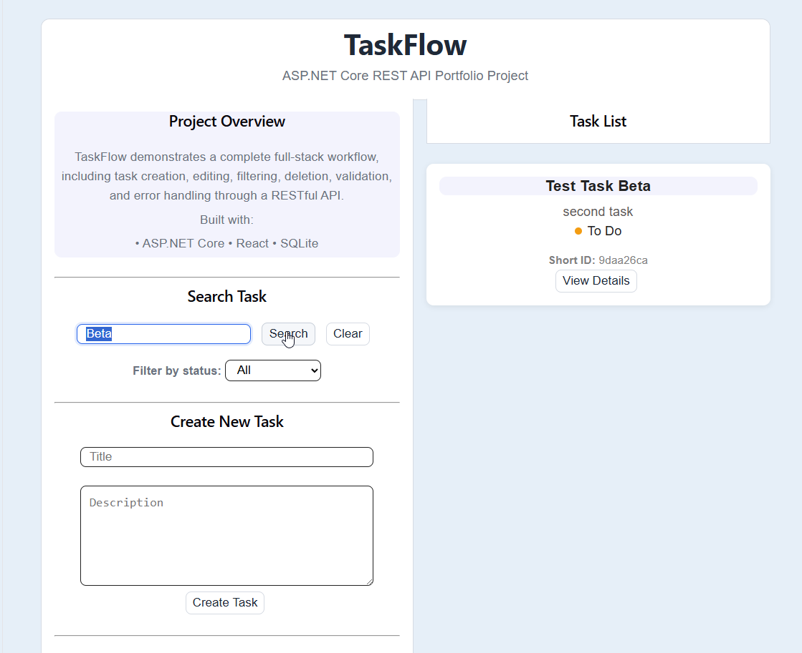
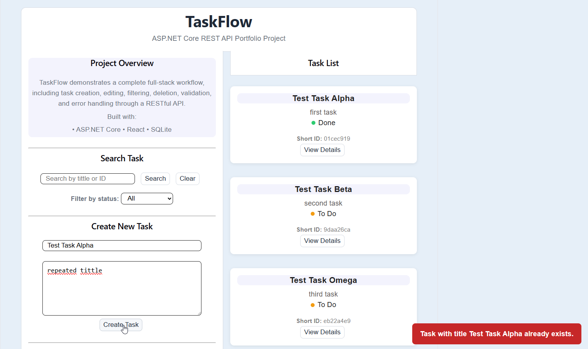

# TaskFlow.API

TaskFlow.API is a RESTful task management application built with C# and ASP.NET Core, with a React frontend used as a demonstration client.

The project was created to practice backend development, REST API design, layered architecture, business logic, data persistence and real-world application structure.

---

## 🎯 Project Goal

The main goal of this project was to move beyond a simple CRUD application and build a more structured backend system following common development practices.

The project focuses on:

* Clear separation of responsibilities
* RESTful API design
* Business rule enforcement
* Data persistence
* Consistent error handling
* Repository and service patterns
* Automated database migrations
* Unit testing
* Deployment using Docker

The React frontend was developed as a client application to demonstrate and interact with the API.

---

## 🎥 Demo Video

[](https://www.youtube.com/watch?v=3aw8QP39dU4)

---

## 🌐 Live Demo

You can try the application online:

**Frontend:** https://taskflow-ui-xi.vercel.app/

**API:** https://taskflow-api-jx6o.onrender.com/

> **Demo Notice:** The application is hosted using free-tier services. Because of this, the first request may take longer if the service is inactive, and demo data may be lost after certain server restarts or redeployments.

---

## 📸 Screenshots

### Main Interface



### Task Details



### Search and Filtering



### Validation and Error Handling



---

## 🚀 Features

### Task Management

* Create tasks
* Update task information
* Change task status
* Delete tasks
* Prevent deletion of completed tasks
* Prevent duplicate task titles
* Validate task titles
* Filter tasks by status

### Search

* Search tasks by title
* Search tasks by full ID
* Search tasks using a Short ID
* Detect ambiguous Short IDs
* Validate minimum Short ID length

### User Interface

* Task list with task details
* Create and edit task forms
* Search and filtering controls
* Confirmation dialog for destructive actions
* Success and error notifications
* Responsive layout
* Status-based visual styling

---

## 🧱 Architecture

The backend follows a layered architecture designed to keep business logic independent from infrastructure and presentation concerns.

```text
React / Vite
     │
     │ HTTP
     ▼
ASP.NET Core Web API
     │
     ▼
Application
     │
     ▼
Core
     │
     ▼
Infrastructure
     │
     ▼
Entity Framework Core
     │
     ▼
SQLite
```

### Core

Contains the domain models, enums and core business concepts.

### Application

Contains application logic, services, repository interfaces, DTOs and business rules.

### Infrastructure

Contains the implementations required to communicate with external systems, including Entity Framework Core, SQLite and repository implementations.

### API

Contains controllers, middleware, configuration and the HTTP layer of the application.

### Frontend

A separate React/Vite application that consumes the REST API and provides a graphical interface for demonstrating its functionality.

---

## 🔐 Business Rules

TaskFlow.API enforces business rules at the backend level rather than relying exclusively on frontend validation.

Some of the implemented rules include:

* Task titles cannot be empty.
* Task titles have a maximum length.
* Duplicate task titles are not allowed.
* Completed tasks cannot be deleted.
* Short ID searches require a minimum number of characters.
* Ambiguous Short IDs return a specific error.
* Tasks that do not exist return a specific not-found error.
* Invalid task state transitions are rejected.

This keeps the business rules independent from the client application.

---

## ⚠️ Error Handling

The API uses custom exceptions and centralized exception handling middleware to provide consistent HTTP responses.

Examples include:

| HTTP Status | Error                   | Description                               |
| ----------- | ----------------------- | ----------------------------------------- |
| `400`       | `VALIDATION_ERROR`      | Invalid request data                      |
| `400`       | `INVALID_STATE`         | Invalid task state operation              |
| `400`       | `AMBIGUOUS_ID`          | Short ID matches multiple tasks           |
| `404`       | `TASK_NOT_FOUND`        | Requested task does not exist             |
| `409`       | `DUPLICATE_TITLE`       | A task with the same title already exists |
| `500`       | `INTERNAL_SERVER_ERROR` | Unexpected server error                   |

This prevents controllers from having to manually handle every possible exception and provides a consistent error structure to API clients.

---

## 📡 API Endpoints

| Method   | Endpoint            | Description      |
| -------- | ------------------- | ---------------- |
| `GET`    | `/api/tasks`        | Get all tasks    |
| `GET`    | `/api/tasks/{id}`   | Get a task by ID |
| `GET`    | `/api/tasks/search` | Search tasks     |
| `POST`   | `/api/tasks`        | Create a task    |
| `PUT`    | `/api/tasks/{id}`   | Update a task    |
| `DELETE` | `/api/tasks/{id}`   | Delete a task    |

The search endpoint can be used to search by task title, full ID or Short ID.

The API also exposes an OpenAPI document for endpoint exploration and documentation.

---

## 🧪 Testing

The project includes tests covering important application and business logic scenarios.

Testing focuses on cases such as:

* Task creation
* Task retrieval
* Task updates
* Task deletion
* Duplicate title validation
* Invalid task data
* Task state changes
* Search functionality
* Short ID resolution
* Ambiguous IDs
* Business rule enforcement

The goal is to verify not only that the endpoints work, but also that the application's business rules behave correctly.

---

## 🛠️ Technologies

### Backend

* C#
* .NET 10
* ASP.NET Core
* Entity Framework Core
* SQLite

### Frontend

* React
* Vite
* JavaScript
* CSS

### Tools & Deployment

* Git
* GitHub
* Docker
* Render
* Vercel
* Postman
* OpenAPI

---

## 📁 Project Structure

```text
TaskFlow/
├── TaskFlow.API/
│   ├── DTOs/
│   ├── Controllers/
│   ├── Middleware/
│   └── Program.cs
│
├── TaskFlow.Application/
│   └── Exceptions/
│
├── TaskFlow.Core/
│
├── TaskFlow.Infrastructure/
│   ├── Persistence/
│   │	└── TaskFlowDbContext.cs
│   └── Migrations/
│
├── TaskFlow.Tests/
│   └── Services/
│
├── taskflow-ui/
│   ├── package.json
│   └── vite.config.js
│
├── Dockerfile
├── TaskFlow.API.slnx
└── README.md
```

---

## 💾 Data Persistence

TaskFlow.API uses Entity Framework Core with SQLite for data persistence.

Database changes are managed through EF Core migrations.

The API automatically applies pending migrations when it starts, allowing a new deployment to initialize or update the database without requiring manual migration commands.

---

## 🐳 Docker

The API is containerized using Docker.

The Docker image uses a multi-stage build:

```text
.NET SDK
   ↓
Restore
   ↓
Build
   ↓
Publish
   ↓
ASP.NET Runtime
```

This allows the application to be built in an SDK environment while keeping the final runtime image smaller.

---

## ☁️ Deployment

The backend is deployed using Render and the React frontend is deployed using Vercel.

The frontend communicates with the deployed ASP.NET Core API through HTTP requests.

The application also uses CORS configuration to allow communication between the development frontend and the deployed frontend.

---

## ▶️ How to Run Locally

### Backend

Clone the repository:

```bash
git clone YOUR_GITHUB_REPOSITORY_URL
cd TaskFlow
```

Restore the .NET dependencies:

```bash
dotnet restore
```

Run the API:

```bash
dotnet run --project TaskFlow.API
```

The API will be available at the local URL shown by ASP.NET Core.

### Frontend

Navigate to the frontend directory:

```bash
cd taskflow-ui
```

Install dependencies:

```bash
npm install
```

Create a `.env` file:

```env
VITE_API_URL=http://localhost:5144
```

Start the development server:

```bash
npm run dev
```

---

## 📚 What I Learned

This project helped me develop and reinforce several backend development concepts:

* Designing RESTful APIs with ASP.NET Core
* Applying layered architecture in a real application
* Separating business logic from infrastructure concerns
* Implementing the repository and service patterns
* Working with Entity Framework Core
* Managing database migrations
* Designing consistent API error responses
* Creating custom exceptions and centralized exception handling
* Implementing search and filtering logic
* Writing automated tests for business rules
* Containerizing an ASP.NET Core application with Docker
* Deploying a backend and frontend as separate services
* Connecting a React client to a remotely deployed API
* Using Git and GitHub throughout an incremental development workflow

---

## 👤 Author

Juan Manuel Blanca
